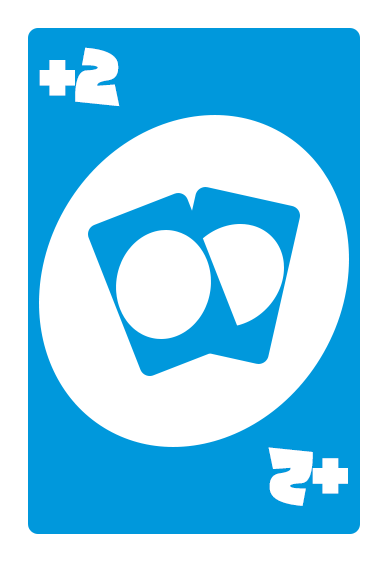
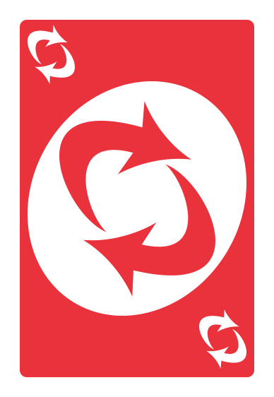
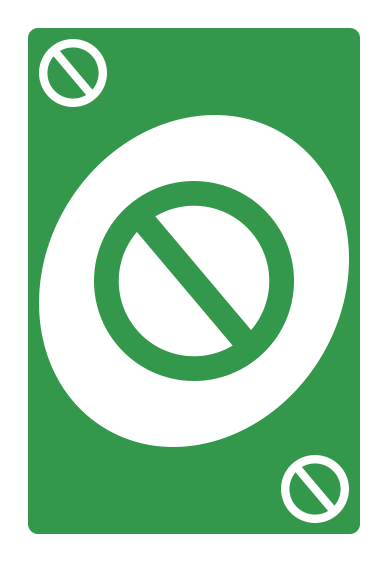
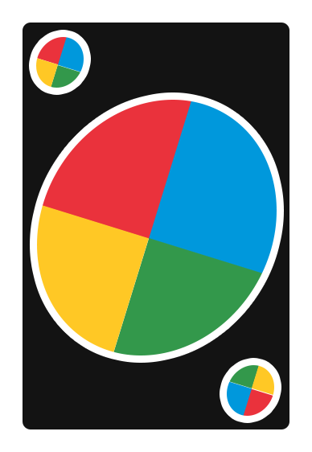
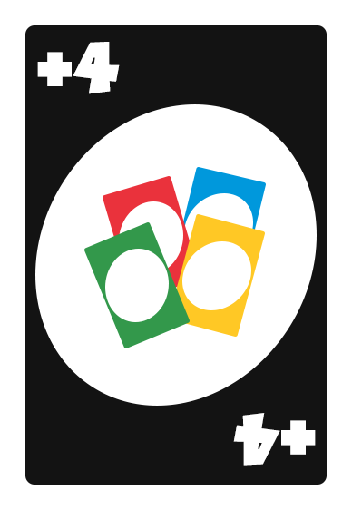

# UNO

## Objective of the game
Be the first to run out of cards.

## Game rules
1. Each player will receive 7 starting cards and there will be a starting card on the table, along with a deck for drawing cards.
2. When it is your turn, you must place a card that matches, either in number or color, with the card on the table.
    
    *Example: If the table card is a red 7, you have to place a red card of any number or a 7 of any color. You can also place an action card.*
3. If you don't have any cards that you can place, then they have to grab one from the deck on the table.
4. Whether you've put down a card or picked one from the deck, your turn goes to the next player.
5. When you are left with a single card you must press the "UNO" button, if someone presses it before you, you will have to take two cards from the deck. If an opponent has only one card and does not press "UNO" then you can press it and the opponent will receive two penalty cards.
6. The player who runs out of cards wins.

## Action cards

<table>
    <tr>
        <td valign="top"></td>
        <td valign="top"><b>Draw Two Card:</b> When this card is placed, the next player draws two cards and loses his turn. This card can only be discarded onto a card of the same color or onto another Draw 2 card.</td>
    </tr>
    <tr>
        <td valign="top"></td>
        <td valign="top"><b>Reverse Card:</b> change the direction of the game. If the player to the left of the person placing the card were to play, this player loses his turn; instead the person on the right will play, and the direction will shift to the right. This card can only be discarded on a card of the same color or on another Reverse card.</td>
    </tr>
    <tr>
        <td valign="top"></td>
        <td valign="top"><b>Skip Card:</b> the player whose turn it is to play loses his turn and it is the turn of the next one according to the direction of the game. This card can only be discarded on a card of the same color or on another Jump card.</td>
    </tr>
    <tr>
        <td valign="top"></td>
        <td valign="top"><b>Wild Card:</b> the player who discards this card will say the new color that will be played or can repeat the one that was already there to be discarded. This card can be placed with any card.</td>
    </tr>
    <tr>
        <td valign="top"></td>
        <td valign="top"><b>Wild Draw Four Card:</b> whoever places this card chooses its color and makes the next player draw 4 cards from the deck on the table and lose their turn. This card can be placed with any card.</td>
    </tr>
</table>

### `yarn start`

The page will reload if you make edits.\
You will also see any lint errors in the console.

**Note: this is a one-way operation. Once you `eject`, you can’t go back!**

